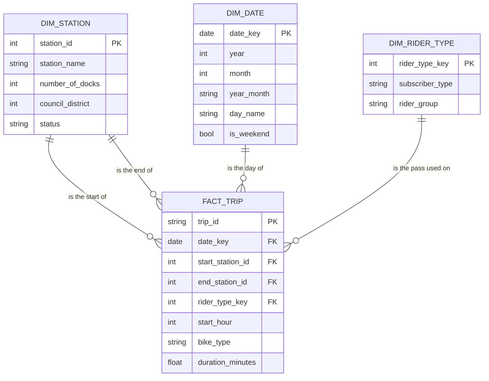

# Module 4: Final Proposal

**Team:** Sample Team (Sample Member A, B and C). One file for the whole team.
**Repo:** this repository. Links in this file point to files in it.

## 1. Stakeholder and questions, refined

**Stakeholder.** A senior planner in a city transportation department. Before next spring the planner must decide
where the city adds docks and where the rebalancing van goes. The planner wants one page with numbers.

**What changed from the draft, and why.**

| Draft | Final | Why |
|---|---|---|
| Q1. Busiest stations, and busiest per dock | Q1. Busiest stations in the current system (2025). Per dock only for the legacy system (2023). | The city's station list has dock counts for legacy stations only. See the feedback-closure memo. |
| Q2. When do people ride, by rider type | Q2. Same. | No change. |
| Q3. Which stations gain or lose bikes | Q3. Same, current system, 2025. | Team Y: say which system each station answer is about. |
| Q4. How ridership changed over three years | Q4. Same, by month, with July 2024 marked. | July 2024 has 2,035 trips. It looks like a change of system, and a reader must not take it for a real drop. |
| Q5. Where should new stations go | Dropped. | The trips only show stations that exist. |

**Final questions.**

1. Which stations are the busiest? And where we have dock counts, which are busy for their size?
2. When do people ride (hour of day, weekday or weekend), and does it differ by rider type?
3. Which stations end up with more bikes than they started with, and which with fewer?
4. How did ridership change from 2023 to 2025?

## 2. Dimensional schema

**Grain: one row of `fact_trip` is one bike trip that started from 2023-01-01 to 2025-12-31.**

**Facts and dimensions.** The fact is the trip. Its measures are a count of trips and `duration_minutes`.
The dimensions are the things we count trips by: station (twice, start and end), date, and rider type.
Start hour and bike type are plain columns on the fact, because each has only a few values and no attributes of
its own.

**Why this grain.** We compared it with two others.

- *One row per station per day.* Smaller, and enough for questions 1 and 4. But question 2 needs the hour and the
  rider type, and question 3 needs start and end together. We would have to rebuild the table for each question.
- *One row per station per hour.* Enough for question 2, but it still loses the link between where a trip started
  and where it ended.
- *One row per trip.* Answers all four questions with a `GROUP BY`. The source is already at this grain, so no
  detail is invented or lost. The cost is size, and the size is small: 908,851 rows for three years.

The grain is also easy to check: the fact must have exactly as many rows as the source has trips in the date
range, and no `trip_id` twice.

## 3. ETL plan

**Sources.**

| Source | Location | One row is | Size | Refresh |
|---|---|---|---|---|
| Trips | `bigquery-public-data.austin_bikeshare.bikeshare_trips` | one bike trip | 2,916,659 rows, 0.33 GB, December 2013 to August 2026 | The table still gets new months. We do not know the schedule. |
| Stations | `bigquery-public-data.austin_bikeshare.bikeshare_stations` | one station as the city lists it | 101 rows | Rows were last edited in 2021 and 2022. |

No outside data.

**Column map.** Fact measures and the dimension attributes our questions use.

| Destination | Source column | Transformation | Owner |
|---|---|---|---|
| `fact_trip.trip_id` | `bikeshare_trips.trip_id` | none | A |
| `fact_trip.date_key` | `bikeshare_trips.start_time` | `DATE(start_time)`; keep only 2023-01-01 to 2025-12-31 | A |
| `fact_trip.start_hour` | `bikeshare_trips.start_time` | `EXTRACT(HOUR ...)` | A |
| `fact_trip.start_station_id` | `bikeshare_trips.start_station_id` | none | A |
| `fact_trip.end_station_id` | `bikeshare_trips.end_station_id` | stored as text in the source; cast to a whole number | A |
| `fact_trip.rider_type_key` | `bikeshare_trips.subscriber_type` | look up the key in `dim_rider_type` | A |
| `fact_trip.bike_type` | `bikeshare_trips.bike_type` | none | A |
| `fact_trip.duration_minutes` | `bikeshare_trips.duration_minutes` | none (tentative: decide what to do with very long trips) | A |
| `dim_station.station_id` | `bikeshare_trips.start_station_id` | distinct ids found in the trips | B |
| `dim_station.station_name` | `bikeshare_trips.start_station_name` | the name that goes with the id | B |
| `dim_station.number_of_docks` | `bikeshare_stations.number_of_docks` | joined on station id; empty when the city list has no row (tentative: how many will match) | B |
| `dim_station.council_district` | `bikeshare_stations.council_district` | joined on station id | B |
| `dim_date.date_key` | generated | one row per day in the date range | C |
| `dim_date.is_weekend` | generated | true for Saturday and Sunday | C |
| `dim_rider_type.subscriber_type` | `bikeshare_trips.subscriber_type` | distinct pass names in the date range | C |
| `dim_rider_type.rider_group` | `bikeshare_trips.subscriber_type` | our own grouping of pass names (tentative: the group for each name) | C |

Remaining attributes follow the same pattern.

**Load order, with one check per step.**

| Step | What | Check that proves it ran |
|---|---|---|
| 1 | `stg_trips` view: columns picked, date range fixed | row count equals a direct count on the public table for the same dates |
| 2 | `stg_stations` view | 101 rows |
| 3 | `dim_station` | one row per station id |
| 4 | `dim_date` | 1,096 rows (three years, one of them a leap year) |
| 5 | `dim_rider_type` | one row per pass name; every name has a group |
| 6 | `fact_trip` | same row count as step 1; no `trip_id` twice; no trip without a station, date or rider type |

Cleaning steps are views. The star is built as tables with `CREATE OR REPLACE TABLE`, so a second run gives the
same counts. Queries name tables by dataset only (`sample_bikeshare_star.fact_trip`), with no project name.

**Scope by Module 6.** All six steps, running end to end from the repo, and the analyses for questions 1 and 4.
Questions 2 and 3 follow in Modules 7 and 8.

**Left out.** New station locations (question 5). Weather. Any map work.

**Named risk and fallback.** *Station ids may not be stable.* The ids changed completely in July 2024, and we have
not tested whether an id always means the same station inside one system. If it does not, `dim_station` keyed on
the id will be wrong. Fallback: key the station on its name instead of its id. Member B tests this first, before
anyone builds the fact.
