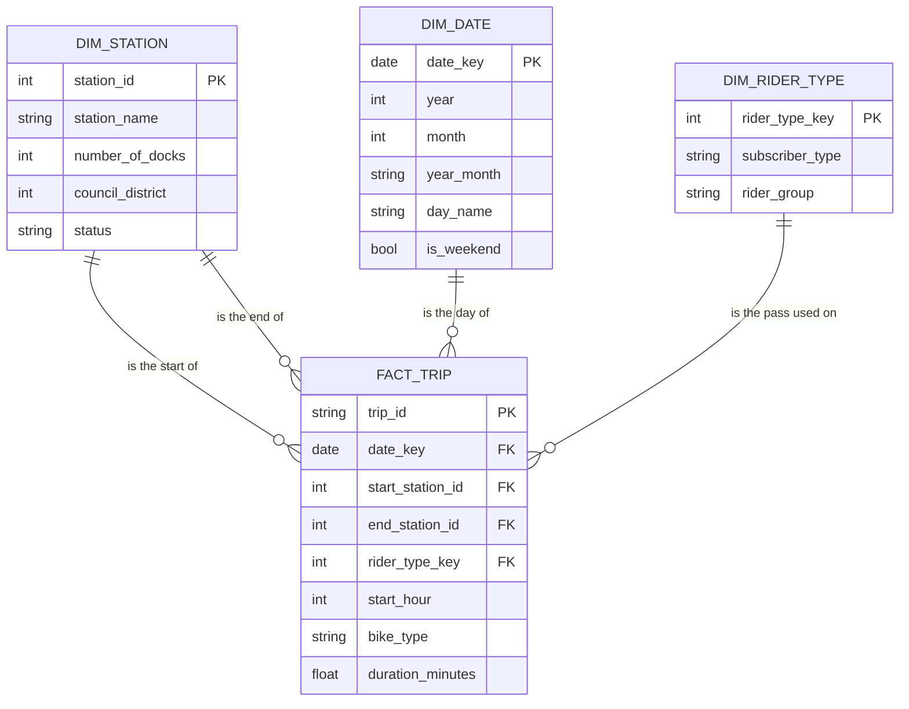

# Module 4: Final Proposal

**Team:** Sample Team (Sample Member A, B and C). One file for the whole team.
**Repo:** this repository. Links in this file point to files in it.

## 1. Stakeholder and questions, refined

**Stakeholder.** A senior planner in a city transportation department. Before next spring the planner must decide
where the city adds docks and where the rebalancing van goes. The planner wants one page with numbers.

**What changed from the draft, and why.**

| Draft | Final | Why |
|---|---|---|
| Q1. Busiest stations, and busiest per dock | Q1. Busiest stations in the current system (2025). Per dock only for the legacy system (2023). | The city's station list has dock counts for legacy stations only. See the feedback-closure memo. |
| Q2. When do people ride, by rider type | Q2. Same. | No change. |
| Q3. Which stations gain or lose bikes | Q3. Same, current system, 2025. | Team Y: say which system each station answer is about. |
| Q4. How ridership changed over three years | Q4. Same, by month, with July 2024 marked. | July 2024 has 2,035 trips. It looks like a change of system, and a reader must not take it for a real drop. |
| Q5. Where should new stations go | Dropped. | The trips only show stations that exist. |

**Final questions.**

1. Which stations are the busiest? And where we have dock counts, which are busy for their size?
2. When do people ride (hour of day, weekday or weekend), and does it differ by rider type?
3. Which stations end up with more bikes than they started with, and which with fewer?
4. How did ridership change from 2023 to 2025?

## 2. Dimensional schema

**Grain: one row of `fact_trip` is one bike trip that started from 2023-01-01 to 2025-12-31.**

**Facts and dimensions.** The fact is the trip. Its measures are a count of trips and `duration_minutes`.
The dimensions are the things we count trips by: station (twice, start and end), date, and rider type.
Start hour and bike type are plain columns on the fact, because each has only a few values and no attributes of
its own.

**Why this grain.** We compared it with two others.

- *One row per station per day.* Smaller, and enough for questions 1 and 4. But question 2 needs the hour and the
  rider type, and question 3 needs start and end together. We would have to rebuild the table for each question.
- *One row per station per hour.* Enough for question 2, but it still loses the link between where a trip started
  and where it ended.
- *One row per trip.* Answers all four questions with a `GROUP BY`. The source is already at this grain, so no
  detail is invented or lost. The cost is size, and the size is small: 908,851 rows for three years.

The grain is also easy to check: the fact must have exactly as many rows as the source has trips in the date
range, and no `trip_id` twice.
