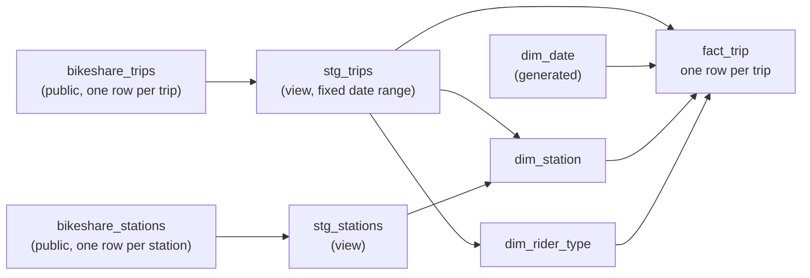

# Module 5: Analysis Draft

A checkpoint on our build. One file: the data diagram, the pipeline sketch, and two queries we ran.

## Data diagram

What we are working with today. Two public tables and the four tables we plan to build.

## Pipeline sketch

| Step | What happens | Status today |
|---|---|---|
| 1 | Make a dataset named `sample_bikeshare_star` | done, each of us in our own BigQuery |
| 2 | `stg_trips`: pick columns, fix the date range (2023-01-01 to 2025-12-31) | written and running |
| 3 | `stg_stations`: pick columns from the city's station list | written and running |
| 4 | `dim_station`: one row per station | not built. Member B is testing whether station ids are stable. So far: no id is used in both the old and the new system |
| 5 | `dim_date`: one row per day | written, not yet run |
| 6 | `dim_rider_type`: one row per pass name, with a group | pass names listed, groups not agreed |
| 7 | `fact_trip`: join trips to the three dimensions | not started |
| 8 | Print row counts, compare with the source | not started |
| 9 | Analyses for the four questions | not started |

Output: four tables in BigQuery and a small result for each question.
