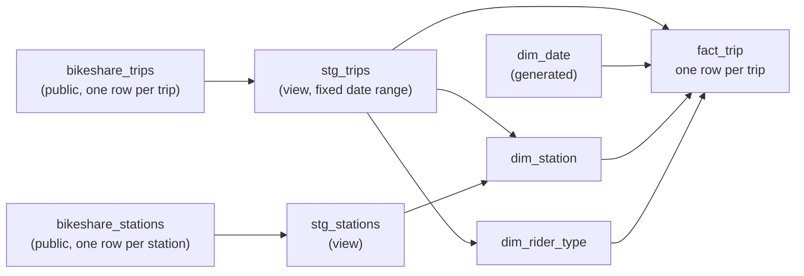

# Module 5: Analysis Draft

A checkpoint on our build. One file: the data diagram, the pipeline sketch, and two queries we ran.

## Data diagram

What we are working with today. Two public tables and the four tables we plan to build.



## Pipeline sketch

| Step | What happens | Status today |
|---|---|---|
| 1 | Make a dataset named `sample_bikeshare_star` | done, each of us in our own BigQuery |
| 2 | `stg_trips`: pick columns, fix the date range (2023-01-01 to 2025-12-31) | written and running |
| 3 | `stg_stations`: pick columns from the city's station list | written and running |
| 4 | `dim_station`: one row per station | not built. Member B is testing whether station ids are stable. So far: no id is used in both the old and the new system |
| 5 | `dim_date`: one row per day | written, not yet run |
| 6 | `dim_rider_type`: one row per pass name, with a group | pass names listed, groups not agreed |
| 7 | `fact_trip`: join trips to the three dimensions | not started |
| 8 | Print row counts, compare with the source | not started |
| 9 | Analyses for the four questions | not started |

Output: four tables in BigQuery and a small result for each question.

## Query A

**Question it answers:** how many trips per year fall inside our date range?

```sql
SELECT EXTRACT(YEAR FROM start_time) AS year, COUNT(*) AS trips
FROM `bigquery-public-data.austin_bikeshare.bikeshare_trips`
WHERE start_time >= '2023-01-01' AND start_time < '2026-01-01'
GROUP BY year
ORDER BY year;
```

| year | trips |
|---|---|
| 2023 | 283,964 |
| 2024 | 252,498 |
| 2025 | 372,389 |

Total 908,851. This is the number our fact table must match.

## Query B

**Question it answers:** how many trips started in each month of 2024?

```sql
SELECT FORMAT_TIMESTAMP('%Y-%m', start_time) AS month, COUNT(*) AS trips
FROM `bigquery-public-data.austin_bikeshare.bikeshare_trips`
WHERE start_time >= '2024-01-01' AND start_time < '2025-01-01'
GROUP BY month
ORDER BY month;
```

| month | trips |
|---|---|
| 2024-01 | 15,490 |
| 2024-02 | 28,102 |
| 2024-03 | 32,207 |
| 2024-04 | 33,203 |
| 2024-05 | 17,764 |
| 2024-06 | 14,378 |
| 2024-07 | 2,035 |
| 2024-08 | 11,526 |
| 2024-09 | 24,274 |
| 2024-10 | 30,211 |
| 2024-11 | 25,212 |
| 2024-12 | 18,096 |

**A number we do not believe as it stands: July 2024, 2,035 trips.** June has 14,378 and August has 11,526. We do
not think ridership fell by more than 80% for one month. We think the operator changed systems in July and part of the
month is missing. We have not confirmed this yet. If the trend answer for question 4 includes July 2024 without
a note, it will mislead the planner. Next step: count trips per day around July 2024.

## Where we are stuck

Step 4. We want to be sure the station ids are safe to join on before we build `dim_station` and the fact.
We would like to talk about what else to test with our mentor.
