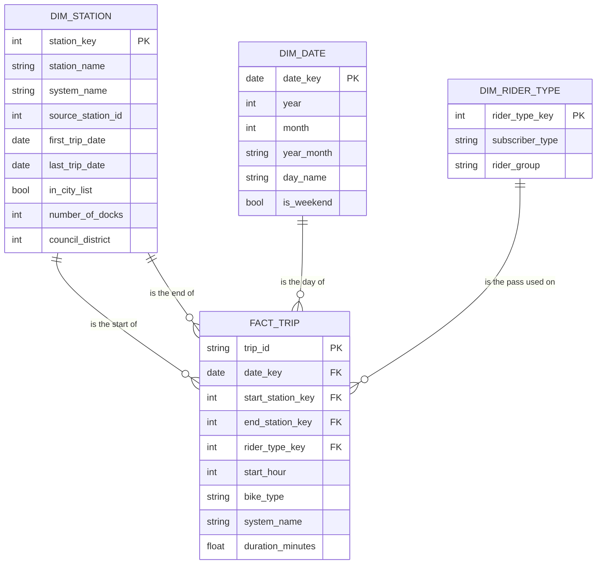

Module 6 Data Product: what the team uploaded to the review tool as one PDF (this markdown is the source of that PDF).

Back to the [project README](../README.md) · [the same document as a PDF](m6-data-product-submission.pdf)

> **As submitted, with its gaps.** Section 1 leaves out "make the dataset first". Reviewers and the mentor flagged
> it (see [feedback-closure item 1](feedback-closure.md)). Put that step in yours. To make your PDF: print this page
> from GitHub, or export your notebook to PDF.

# Sample Team: Austin bikeshare data product (Module 6)

Team: Sample Team (Sample Member A, Sample Member B, Sample Member C).

Reviewers cannot open our repo, so everything a reviewer needs is in this one document, in this order:

1. How to rebuild it (our README at Module 6)
2. The star schema and its grain
3. Every query in `etl/`, in the order it runs
4. Row counts for every table
5. Two analyses, with their results
6. Our recovery note

Not included: our member folders and any feedback we have received.

## 1. How to rebuild it

This is the rebuild section of our README as it stood at Module 6.

> We are answering four questions about Austin's shared bikes for a city transportation planner, from the public
> dataset `bigquery-public-data.austin_bikeshare`. Trips from 2023-01-01 to 2025-12-31.
>
> **Run it**
>
> ```
> sh etl/run_all.sh YOUR_PROJECT_ID
> ```
>
> This runs the seven files in `etl/` in order and prints the row counts. Compare them with `warehouse/README.md`.
>
> **Where things are**
>
> - `etl/`: the queries that build the tables
> - `analyses/`: questions 1 and 4 so far
> - `validation/`: five checks
> - `docs/m6-recovery-note.md`: what went wrong in our first build and how we fixed it
> - `docs/`: our earlier milestones

The seven queries are in section 3 and the row counts are in section 4.

## 2. Star schema and grain

**Grain:** one row of `fact_trip` is one bike trip that started from 2023-01-01 to 2025-12-31.



`dim_station` is joined to the fact twice: once for where a trip started and once for where it ended.

## 3. The queries in `etl/`, in order

Run them in number order. Each file says who owns it at the top.

### `etl/01_stg_trips.sql`

```sql
-- 01_stg_trips.sql   Owner: Member A
-- A VIEW (a saved query, stores nothing). Picks the columns we need, cleans the station names,
-- and fixes the date range.
-- The date range lives here: trips that started from 2023-01-01 up to, but not including, 2026-01-01.
-- (04_dim_date.sql uses the same two dates.)
CREATE OR REPLACE VIEW sample_bikeshare_star.stg_trips AS
SELECT
  trip_id,
  start_time,
  DATE(start_time)                    AS trip_date,
  EXTRACT(HOUR FROM start_time)       AS start_hour,
  -- The operator changed systems in July 2024. No trips exist from 2024-07-01 to 2024-07-23.
  -- Station ids and many station names are different before and after.
  IF(DATE(start_time) < '2024-07-01', 'legacy', 'current') AS system_name,
  start_station_id,
  -- Names carry stray tabs and trailing spaces in the source. Squash all whitespace to single spaces.
  TRIM(REGEXP_REPLACE(start_station_name, r'\s+', ' ')) AS start_station_name,
  TRIM(REGEXP_REPLACE(end_station_name,   r'\s+', ' ')) AS end_station_name,
  subscriber_type,
  bike_type,
  duration_minutes
FROM `bigquery-public-data.austin_bikeshare.bikeshare_trips`
WHERE start_time >= '2023-01-01'
  AND start_time <  '2026-01-01';
```

### `etl/02_stg_stations.sql`

```sql
-- 02_stg_stations.sql   Owner: Member B
-- A VIEW over the city's station list. Picks the columns we use.
CREATE OR REPLACE VIEW sample_bikeshare_star.stg_stations AS
SELECT
  station_id,
  name              AS city_station_name,
  status,
  number_of_docks,
  council_district
FROM `bigquery-public-data.austin_bikeshare.bikeshare_stations`;
```

### `etl/03_dim_station.sql`

```sql
-- 03_dim_station.sql   Owner: Member B
-- One row per station NAME in one SYSTEM (legacy or current), from both ends of every trip.
-- Why the name and not the id: one id can carry two names over time, and in 2023 the end station id
-- often disagrees with the end station name on the same trip. See docs/m6-recovery-note.md.
CREATE OR REPLACE TABLE sample_bikeshare_star.dim_station AS
WITH seen AS (
  SELECT system_name, start_station_name AS station_name, start_station_id AS station_id, trip_date
  FROM sample_bikeshare_star.stg_trips
  UNION ALL
  SELECT system_name, end_station_name, NULL, trip_date      -- end ids are not trusted, so not used
  FROM sample_bikeshare_star.stg_trips
),
per_station AS (
  SELECT
    system_name,
    station_name,
    MIN(station_id) AS source_station_id,     -- the id trips START with; empty if the name only appears as an end
    MIN(trip_date)  AS first_trip_date,
    MAX(trip_date)  AS last_trip_date
  FROM seen
  GROUP BY system_name, station_name
)
SELECT
  ROW_NUMBER() OVER (ORDER BY p.system_name, p.station_name) AS station_key,
  p.station_name,
  p.system_name,
  p.source_station_id,
  p.first_trip_date,
  p.last_trip_date,
  c.station_id IS NOT NULL AS in_city_list,
  c.number_of_docks,
  c.council_district
FROM per_station AS p
LEFT JOIN sample_bikeshare_star.stg_stations AS c
  ON p.system_name = 'legacy'      -- the city list only knows legacy ids
  AND c.station_id = CASE p.source_station_id
                       WHEN 2498 THEN 3794     -- these two ids are swapped between the trips and the city list
                       WHEN 3794 THEN 2498     -- (Dean Keeton/Speedway and 4th/Sabine)
                       ELSE p.source_station_id
                     END;
```

### `etl/04_dim_date.sql`

```sql
-- 04_dim_date.sql   Owner: Member C
-- One row per calendar day in the project's date range (the same range as 01_stg_trips.sql).
CREATE OR REPLACE TABLE sample_bikeshare_star.dim_date AS
SELECT
  d                                   AS date_key,
  EXTRACT(YEAR FROM d)                AS year,
  EXTRACT(MONTH FROM d)               AS month,
  FORMAT_DATE('%Y-%m', d)             AS year_month,
  FORMAT_DATE('%A', d)                AS day_name,
  EXTRACT(DAYOFWEEK FROM d) IN (1, 7) AS is_weekend      -- 1 is Sunday, 7 is Saturday
FROM UNNEST(GENERATE_DATE_ARRAY('2023-01-01', '2025-12-31')) AS d;
```

### `etl/05_dim_rider_type.sql`

```sql
-- 05_dim_rider_type.sql   Owner: Member C
-- One row per pass or membership name found in the trips, with a simpler rider group.
CREATE OR REPLACE TABLE sample_bikeshare_star.dim_rider_type AS
SELECT
  ROW_NUMBER() OVER (ORDER BY subscriber_type) AS rider_type_key,
  subscriber_type,
  CASE
    WHEN subscriber_type IN ('Student Membership', 'U.T. Student Membership') THEN 'Student'
    WHEN subscriber_type IN ('Annual', 'Local365', 'Local365+Guest Pass')     THEN 'Annual member'
    WHEN subscriber_type IN ('31 Day Pass', 'Local31')                        THEN 'Monthly member'
    WHEN subscriber_type IN ('1 Day Pass', '24 Hour Walk Up Pass', '3-Day Weekender', 'Explorer',
                             'Pay-as-you-ride', 'Single Trip (Pay-as-you-ride)', 'Single Trip Ride')
                                                                              THEN 'Casual'
    ELSE 'Other'
  END AS rider_group
FROM (SELECT DISTINCT subscriber_type FROM sample_bikeshare_star.stg_trips);
```

### `etl/06_fact_trip.sql`

```sql
-- 06_fact_trip.sql   Owner: Member A
-- Grain: one row per bike trip that started inside the date range.
-- Stations are matched on system and cleaned name, never on the id (see docs/m6-recovery-note.md).
CREATE OR REPLACE TABLE sample_bikeshare_star.fact_trip AS
SELECT
  t.trip_id,
  t.trip_date          AS date_key,
  t.start_hour,
  ss.station_key       AS start_station_key,
  es.station_key       AS end_station_key,
  r.rider_type_key,
  t.bike_type,
  t.system_name,
  t.duration_minutes
FROM sample_bikeshare_star.stg_trips AS t
LEFT JOIN sample_bikeshare_star.dim_station AS ss
  ON ss.system_name = t.system_name AND ss.station_name = t.start_station_name
LEFT JOIN sample_bikeshare_star.dim_station AS es
  ON es.system_name = t.system_name AND es.station_name = t.end_station_name
LEFT JOIN sample_bikeshare_star.dim_rider_type AS r
  ON r.subscriber_type = t.subscriber_type;
```

### `etl/07_row_counts.sql`

```sql
-- 07_row_counts.sql   Owner: Member C
-- Last step of the build. Prints the row count of every table, to compare with warehouse/README.md.
SELECT 'dim_date' AS table_name, COUNT(*) AS row_count FROM sample_bikeshare_star.dim_date
UNION ALL SELECT 'dim_rider_type', COUNT(*) FROM sample_bikeshare_star.dim_rider_type
UNION ALL SELECT 'dim_station',    COUNT(*) FROM sample_bikeshare_star.dim_station
UNION ALL SELECT 'fact_trip',      COUNT(*) FROM sample_bikeshare_star.fact_trip
UNION ALL SELECT 'stg_trips (view)',    COUNT(*) FROM sample_bikeshare_star.stg_trips
UNION ALL SELECT 'stg_stations (view)', COUNT(*) FROM sample_bikeshare_star.stg_stations
ORDER BY table_name;
```

## 4. Row counts

Built on 2026-09-30, after the station join fix. File 07 prints these counts.

| Table | Kind | One row is | Rows |
|---|---|---|---|
| `fact_trip` | table | one bike trip that started from 2023-01-01 to 2025-12-31 | 908,851 |
| `dim_station` | table | one station name in one system (legacy or current) | 171 |
| `dim_date` | table | one calendar day from 2023-01-01 to 2025-12-31 | 1,096 |
| `dim_rider_type` | table | one pass or membership name | 17 |
| `stg_trips` | view | one trip in the date range | 908,851 |
| `stg_stations` | view | one station in the city's station list | 101 |

Our first build had 935,544 rows in `fact_trip`. See section 6.

## 5. Two analyses

We have two of our four questions so far: question 1 and question 4.

### Question 1: which stations are the busiest?

```sql
-- Question 1 (Member B): Which stations are the busiest?
-- Answer: E 21st/Speedway @ PCL, by a wide margin: 36,844 trips started there in 2025, 9.9% of all starts.
--         The 11 busiest stations hold 51.7% of all starts. 83 stations had at least one trip.
-- Scope:  current system, calendar year 2025. "Busy" counts trips that start there plus trips that end there.
-- What would make it wrong: a station counted twice under two names. dim_station keeps a renamed station as
--         two rows (three stations were renamed or moved in the current system), so each is ranked on its own.
--         None of the three is near the top 15.
WITH starts AS (
  SELECT start_station_key AS station_key, COUNT(*) AS trips_started
  FROM sample_bikeshare_star.fact_trip AS f
  JOIN sample_bikeshare_star.dim_date AS d ON d.date_key = f.date_key
  WHERE d.year = 2025
  GROUP BY 1
),
ends AS (
  SELECT end_station_key AS station_key, COUNT(*) AS trips_ended
  FROM sample_bikeshare_star.fact_trip AS f
  JOIN sample_bikeshare_star.dim_date AS d ON d.date_key = f.date_key
  WHERE d.year = 2025
  GROUP BY 1
),
per_station AS (
  SELECT
    st.station_name,
    IFNULL(s.trips_started, 0) AS trips_started,
    IFNULL(e.trips_ended, 0)   AS trips_ended
  FROM sample_bikeshare_star.dim_station AS st
  LEFT JOIN starts AS s ON s.station_key = st.station_key
  LEFT JOIN ends   AS e ON e.station_key = st.station_key
  WHERE st.system_name = 'current'
    AND (s.trips_started IS NOT NULL OR e.trips_ended IS NOT NULL)
)
SELECT
  RANK() OVER (ORDER BY trips_started + trips_ended DESC)            AS busy_rank,
  station_name,
  trips_started,
  trips_ended,
  ROUND(100 * trips_started / SUM(trips_started) OVER (), 1)          AS pct_of_all_starts,
  ROUND(100 * SUM(trips_started) OVER (ORDER BY trips_started + trips_ended DESC)
        / SUM(trips_started) OVER (), 1)                              AS running_pct_of_all_starts,
  COUNT(*) OVER ()                                                    AS stations_with_trips_in_2025
FROM per_station
ORDER BY busy_rank
LIMIT 15;
```

**Result.** The query returns 15 rows. The first five:

| busy_rank | station_name | trips_started | trips_ended | pct_of_all_starts |
|---|---|---|---|---|
| 1 | E 21st/Speedway @ PCL | 36,844 | 38,498 | 9.9 |
| 2 | Dean Keeton/Speedway | 21,627 | 28,290 | 5.8 |
| 3 | W 26th/Nueces | 22,660 | 19,380 | 6.1 |
| 4 | W 23rd/San Gabriel | 17,442 | 16,958 | 4.7 |
| 5 | W 22nd/Pearl | 16,598 | 12,898 | 4.5 |

83 stations had at least one trip in 2025. The 11 busiest hold 51.7% of all starts.

### Question 4: how did ridership change?

```sql
-- Question 4 (Member A): How did ridership change across the three years?
-- Answer: 2025 was above 2023 in every month except January (down 7.9%). The biggest rise was April
--         (27,621 trips in 2023, 44,547 in 2025, up 61.3%). October was the busiest month in 2023 and 2025.
-- Scope:  trips per month, one column per year.
-- What would make it wrong: reading 2024 as a normal year. The operator changed systems in July 2024 and
--         there are no trips at all from July 1 to July 23, so July 2024 shows only 2,035 trips.
SELECT
  d.month,
  COUNTIF(d.year = 2023) AS trips_2023,
  COUNTIF(d.year = 2024) AS trips_2024,
  COUNTIF(d.year = 2025) AS trips_2025,
  ROUND(100 * (COUNTIF(d.year = 2025) - COUNTIF(d.year = 2023)) / COUNTIF(d.year = 2023), 1) AS pct_change_2023_to_2025
FROM sample_bikeshare_star.fact_trip AS f
JOIN sample_bikeshare_star.dim_date AS d ON d.date_key = f.date_key
GROUP BY d.month
ORDER BY d.month;
```

**Result.** The query returns 12 rows, one per month. Two of them:

| month | trips_2023 | trips_2024 | trips_2025 |
|---|---|---|---|
| 4 (April) | 27,621 | 33,203 | 44,547 |
| 10 (October) | 38,727 | 30,211 | 49,972 |

2025 was above 2023 in every month except January (down 7.9%). April rose the most, up 61.3%. October was the
busiest month in 2023 and in 2025. July 2024 has only 2,035 trips, against 16,460 in July 2023, because of the
system change.

## 6. Recovery note: the station join

This is `docs/m6-recovery-note.md` from our repo.

This is our recovery evidence for the Project Data Product. It records one wrong turn in the ETL, how we noticed,
and how we fixed it. The wrong version and the fix are both in the commit history (look for the commits that
start with "M6:" and touch `etl/03_dim_station.sql` and `etl/06_fact_trip.sql`).

### What we planned

In the final proposal, `dim_station` had one row per station id, and `fact_trip` joined to it on
`start_station_id` and `end_station_id`. We listed "station ids may not be stable" as our named risk, with
"key the station on its name" as the fallback.

Member B tested the risk before the build, but tested only half of it. The test asked: is any station id used in
both systems? The answer was no. Legacy ids run from 2494 to 7637 and current ids from 10001 to 10092. We read
that as "ids are stable" and went ahead. We never asked whether one id always has one name inside a system.

### What we built first

- `dim_station`: `SELECT DISTINCT start_station_id, start_station_name` from the trips, with docks from the city list.
- `fact_trip`: `stg_trips` joined to `dim_station` twice, on the start id and on the end id.

### How we noticed

Member A ran the join on one month before building the full table, as the course page suggests.

| | January 2023 |
|---|---|
| Trips in `stg_trips` | 22,052 |
| Rows after the join | 22,180 |

128 extra rows in one month. We built the full table anyway to see the size of the problem, and Member C's row
count step showed it:

| Table | Rows | Different trip ids |
|---|---|---|
| `stg_trips` | 908,851 | 908,851 |
| `fact_trip` (first build) | 935,544 | 908,851 |
| `dim_station` (first build) | 167 | 163 station ids |

26,693 extra rows. By year: 972 in 2023, 5,546 in 2024 and 20,175 in 2025. Any count of trips from this table
would have been too high, and most of all in 2025, the year the planner cares about most.

### Cause 1: one id, two names

`dim_station` had 167 rows for 163 ids. Four ids had two rows each:

| Station id | Names |
|---|---|
| 4055 | "11th/Salina" and "11th/Salina " (with a trailing space) |
| 10023 | "E 4th/Neches @ Downtown Station" and "E 5th/Neches @ Downtown Station" |
| 10053 | "E 6th/Robert T. Martinez" and "E 6th/Chicon" |
| 10058 | "Lakeshore/Austin Hostel" and "Lakeshore/Lady Bird Ln." |

One is a typing difference. Three are stations that were renamed or moved and kept their id. Every trip that
started or ended at one of these ids matched two rows in `dim_station`, so it appeared twice in the fact (four
times if both ends were affected). This is a fan-out join.

### Cause 2: the end station id cannot be trusted

While reading the duplicates, Member B compared the end station name on each trip with the name the end id
pointed to. This problem would not have shown up in any row count.

| Year | Trips | Trips whose end id does not lead to the end name on the trip |
|---|---|---|
| 2023 | 283,964 | 47,175 |
| 2024 | 252,498 | 323 |
| 2025 | 372,389 | 297 |

In 2023, one trip in six carried an end id that does not belong to the station the trip names. For example, trips that name
"21st/Speedway @ PCL" as the end station in 2023 carry 59 different end ids. The name on the trip is consistent and never
empty. The id is the unreliable part. A fact table joined on the end id would have sent 47,175 trips in 2023 to
the wrong station, with correct row counts. Our question 3 (which stations gain or lose bikes) depends completely
on the end station.

### The fix

1. `01_stg_trips.sql` (Member A): clean the station names. All whitespace becomes a single space and the ends are
   trimmed. It also adds `system_name`, legacy or current, because the same name can exist in both systems.
2. `03_dim_station.sql` (Member B): one row per station name per system, taken from both the start and the end
   of every trip. The id is kept as `source_station_id`, for reference only. A new `station_key` is the key.
3. `06_fact_trip.sql` (Member A): join to `dim_station` on system and name, never on the id.

### After the fix

| Table | Rows | Different trip ids |
|---|---|---|
| `stg_trips` | 908,851 | 908,851 |
| `fact_trip` | 908,851 | 908,851 |
| `dim_station` | 171 | 171 station keys |

`dim_station` went from 167 rows to 171. The two spellings of "11th/Salina" became one row, and five stations
that only appear as the end of a trip were added. Renamed stations stay as separate rows on purpose.

### What we added so it cannot come back quietly

- Check 2 (one row per trip) catches the fan-out.
- Check 4 (one row per station name per system) catches the cause of the fan-out.
- Check 6 (station names match the source trip) catches the wrong end station. It compares all 908,851 trips.

### What we learned

A matching row count told us the first problem existed. It could not have told us about the second one. We only
found the second because we were already looking at station names by eye. The check we rely on most now is the one
that compares our rows with the source, value by value.

The AI assistant drafted the first join for us and joined on the ids. That was a reasonable reading of the column
names. The mistake was ours: we accepted it without counting names per id first. It is in the AI Attribution Log.
