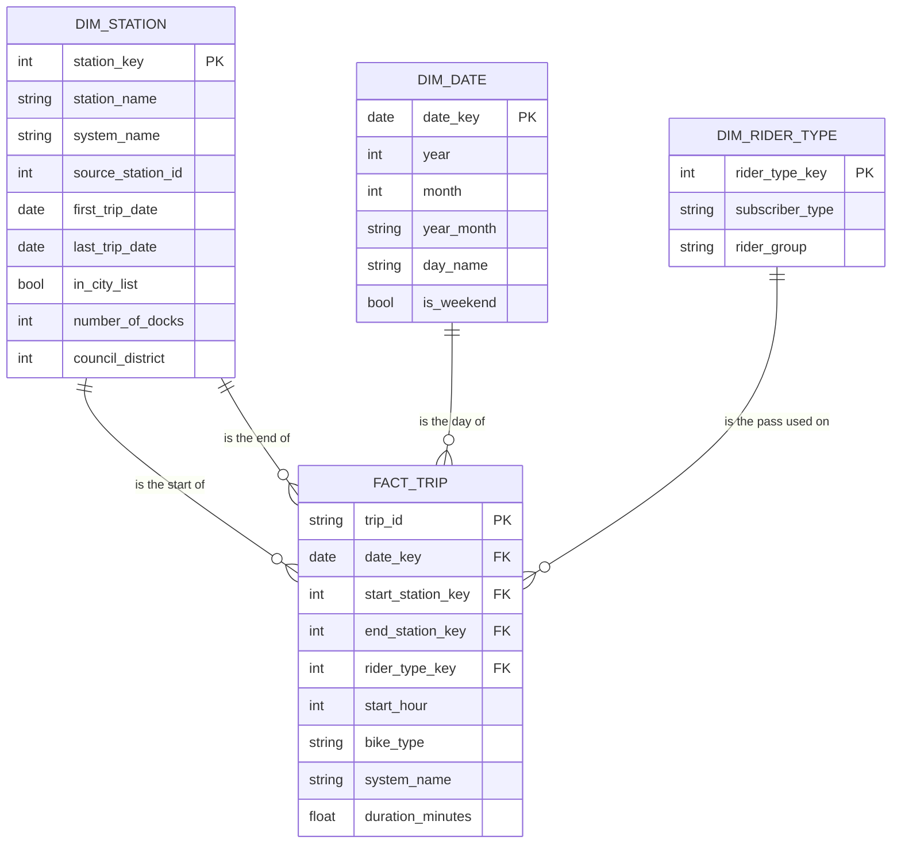

# Schema

## Grain

One row of `fact_trip` is one bike trip that started from 2023-01-01 to 2025-12-31.

## Tables

| Table | One row is | Key | Built from | Owner |
|---|---|---|---|---|
| `fact_trip` | one bike trip | `trip_id` | `stg_trips` and the three dimensions | Member A |
| `dim_station` | one station name in one system (legacy or current) | `station_key` | `stg_trips` (both ends of every trip) and `stg_stations` | Member B |
| `dim_date` | one calendar day | `date_key` (the date itself) | generated | Member C |
| `dim_rider_type` | one pass or membership name | `rider_type_key` | `stg_trips` | Member C |
| `stg_trips` (view) | one trip in the date range, names cleaned | `trip_id` | `bigquery-public-data.austin_bikeshare.bikeshare_trips` | Member A |
| `stg_stations` (view) | one station in the city's list | `station_id` | `bigquery-public-data.austin_bikeshare.bikeshare_stations` | Member B |

## Diagram

`dim_station` is joined to the fact twice: once for where a trip started and once for where it ended.

## Measures

- A count of rows in `fact_trip` is a count of trips.
- `duration_minutes` is the length of the trip. We report the median, because 153 trips are longer than a day.

## Decisions

Each choice a reader might question, and why we made it.

**Why one row per trip.** The planner asks about stations, hours and rider types. All three can be counted from
single trips. A table of trips per station per day would be smaller, but it could not answer the hour question or
the rider type question without being rebuilt. The whole trips table is 0.33 GB, so size was no reason to
roll trips up early.

**Why the station key is the name and system, and the id is only kept for reference.** We planned to use the
station id. It failed in two ways when we built it. Four ids carry two names each, which multiplied trips. And
in 2023 the end station id disagrees with the end station name on 47,175 trips. The name is on every trip and
is never empty, so we trust the name. Details in `docs/m6-recovery-note.md`.

**Why dock counts are missing for current stations.** The city's station list has 101 rows and all of them are
legacy stations. None of the 88 current stations is in it. 71 of the 83 legacy stations are. So "trips per dock"
can only be answered for the legacy system.

**Two ids swapped.** For ids 2498 and 3794 the trips and the city list disagree about which station is which
(Dean Keeton/Speedway and 4th/Sabine). We follow the name on the trips and swap the two ids when we look up
docks. We found this by reading the two name lists side by side. No check would have told us.

**Test and operations rows are kept.** One trip has the pass name "TEST PRODUCT", one touches a station named
"TEST-LucJ", and five touch "Warehouse Station" or "Ready for deployment". We kept these rows (seven at most)
so that the fact table has exactly the same number of trips as the source. They are too few to move any result.